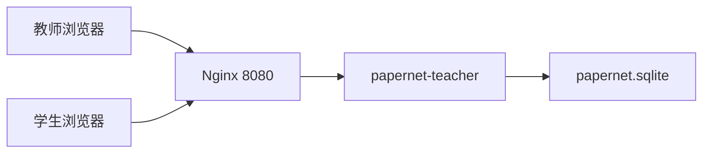
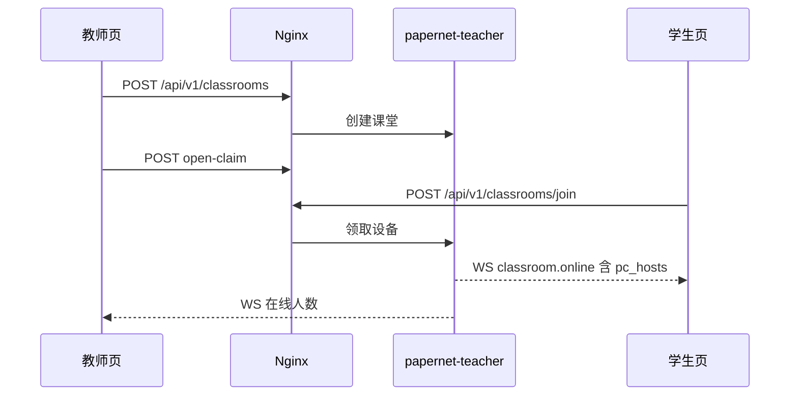

# 架构设计

## 概述

纸上谈网是一套课堂内网推演系统。教师机 `papernet-teacher` 是权威服务：持有课堂状态、SQLite 持久化、HTTP 写接口和 WebSocket 增量广播。学生与教师都用浏览器打开同一主机同一端口上的页面。

教室服务器形态：教师机绑定 `127.0.0.1:80`，只提供 `/api` 与 `/ws`；系统 Nginx 听 `8080`，托管 `/teacher/`、`/student/`，并把接口转到本机 80。防火墙只放行 TCP 8080。

本机预览可以把 `PAPERNET_UI_DIR` 指到编好的静态页，由教师机同时提供页面和接口。Windows 教室包把 exe、dll、静态页放在同一文件夹，双击 `启动教室.bat`。

## 技术栈

**语言与运行时**
- Rust 2021，Cargo workspace，版本 0.2.2
- TypeScript + Vite 5（教师/学生 Web）

**框架**
- Axum 0.8（HTTP / WebSocket）
- rusqlite bundled
- tower-http `ServeDir`（可选静态页）

**数据存储**
- SQLite：`$PAPERNET_DATA_DIR/papernet.sqlite`，默认目录 `data/`

**基础设施**
- 教室：systemd `papernet.service` + 系统 Nginx
- Windows：交叉编译 `x86_64-pc-windows-gnu`

## 项目结构

```
papernet/
├── crates/shared      # 协议、拓扑、可达、模拟帧
├── crates/teacher     # 教师机服务
├── crates/student     # Linux 无界面学生客户端
├── web/teacher        # 教师页
├── web/student        # 学生页
├── web/shared         # 领取、拓扑、工作台
├── assets/models      # 运行时设备照片
├── docs               # 设计与修订记录
├── deploy             # Nginx、systemd、本地运行包
├── scripts            # 编页、预览、Windows 打包、前端检查
└── .monkeycode        # 需求、设计、本 wiki
```

**入口点**
- `crates/teacher/src/main.rs` → `papernet_teacher::run`
- `crates/teacher/src/lib.rs` → 路由、`with_static_ui`
- `web/teacher/src/main.ts`、`web/student/src/main.ts`

## 子系统

### 教师机服务
**目的**: 课堂权威、接口、广播、可选静态页
**位置**: `crates/teacher/`
**关键文件**: `src/lib.rs`, `src/classroom.rs`, `src/db.rs`
**依赖**: `papernet-shared`, SQLite
**被依赖**: 浏览器、Linux `papernet-student`、Nginx

### Web 界面
**目的**: 教师拓扑与学生设备页
**位置**: `web/`
**关键文件**: `web/shared/claim.ts`, `web/shared/topo.ts`, `web/student/src/stage.ts`
**依赖**: `/api`、`/ws`

### 共享协议
**目的**: 设备种类、领取文案、链路与可达、模拟帧改写
**位置**: `crates/shared/src/`

### 教室入口
**目的**: 对外只暴露 8080
**位置**: `deploy/nginx.conf`, `deploy/papernet.service`

## 架构图



## 关键流程



## 设计决策

- 教师机权威；HTTP 写，WS 推增量。
- 已领角色不因断线释放，教师「解除绑定」后才能重领。
- 在线 = 已被领取。`classroom.online` 附带完整 `pc_hosts`。
- TAP 界面名「网络分流器」。
- 教室不用 Docker；页面放 `/var/www/papernet/`。
