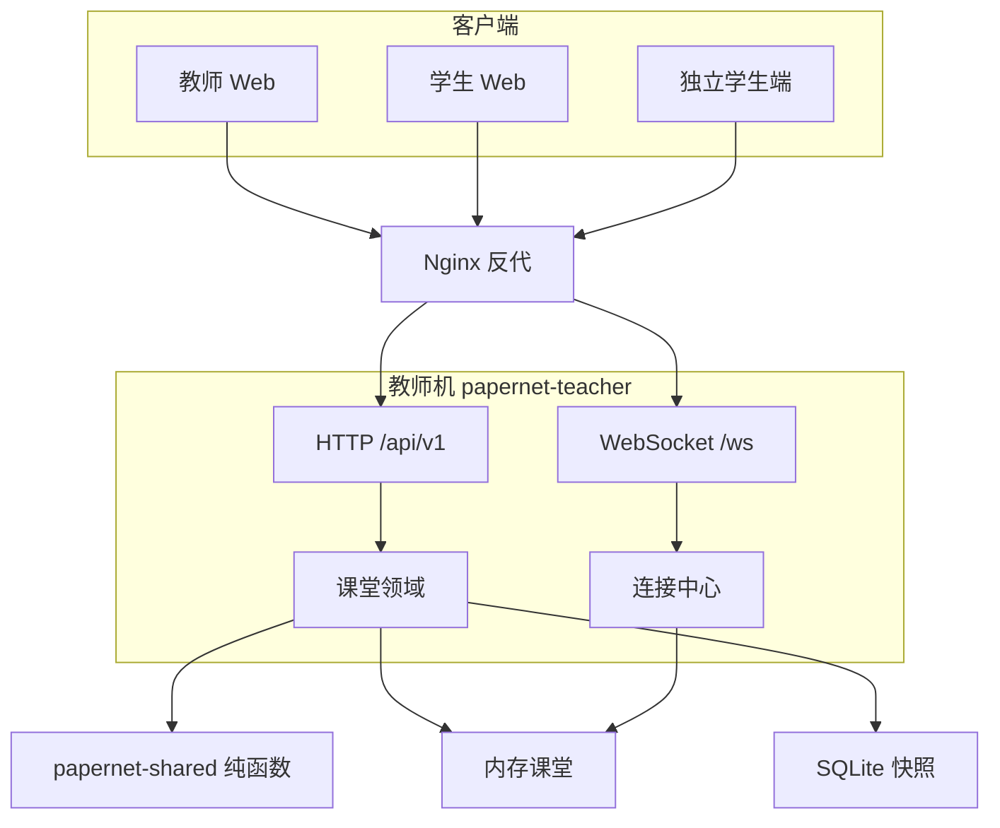

# 纸上谈网 技术设计

Feature Name: classroom-network-sim  
Updated: 2026-09-20（V1.2 用户确认冻结）

## Description

教师机为课堂权威状态机；学生端（独立进程或托管浏览器）各绑一个设备角色。HTTP 写配置与发报文，WebSocket 推增量。详细条文见 `docs/` 四份设计。

## Architecture

独立学生端采集本机 MAC 后，仍经同一 Nginx/教师机接口领取角色。

## Components and Interfaces

| 组件 | 职责 |
| --- | --- |
| papernet-shared | 端口编号、互指、表项生成、可达性、选口校验、帧 MAC 改写 |
| papernet-teacher | 课堂、API、WS、快照、托管 UI 静态文件 |
| papernet-student | 独立端 MAC、连接教师、拉起学生 UI |
| web/teacher | 定员、拓扑、TAP、模式 |
| web/student | 按 kind 切换 PC/交换机/路由器/TAP 界面 |
| Nginx | 同机入口，预览环境只暴露前端一端口时反代 `/api` 与 `/ws` |

接口清单见 `docs/02-接口设计.md`。

## Data Models

课堂、设备、端口、链路、TAP 挂接、MAC 表、ARP 表、连接、聊天、在途帧。字段与一致性见 `docs/03-数据设计.md`。

运行态在内存；SQLite 只持久化课堂拓扑快照。connection 与 inflight 帧不落盘。

## Correctness Properties

1. 同一 `device_id` 同时只被一条 connection 领取。
2. 已领取角色不因断线或心跳超时释放；仅教师结束课堂后可再领。
3. `physically_up` 当且仅当两端 `peer_port_id` 互指。
4. 交换机不持有 ARP 表；PC/路由器不持有 MAC 地址表。
5. 掩码恒为 `255.255.255.0`。
6. 跨网段可达的必要条件：PC 网关等于通往目的网段的路由器近端口 IP，且沿途物理连通。
7. 模拟模式选错口时 `sim_frame.at_device_id` 不变。
8. 路由器正确转发后：`dst_mac` 为下一跳通信 MAC，`src_mac` 为出口 MAC，IP 与汉字不变。
9. TAP 对对端枚举透明；过路帧进入 tap_log。
10. 领完后的错误文案精确为「本课设备已领完，请看教师屏」。

## Error Handling

| 场景 | 处理 |
| --- | --- |
| 未定员加入 | waiting_open 文案 |
| 领完 | CLASSROOM_FULL |
| 不可达 | UNREACHABLE，不投递 |
| 选错口 | WRONG_PORT，帧保留 |
| WS 断线 | 设备角色仍占用；学生用原 connection_id 重连恢复。不因心跳超时释放角色 |
| 教师机重启 | 从 SQLite 恢复定员与拓扑，清空领取绑定；学生重新 join 再领取 |

## Test Strategy

shared 纯函数单测（互指、表项、可达、选口、改 MAC）必须先于 HTTP 测。阶段用例与通过基线见 `docs/04-后端开发实施规划.md`。冒烟使用临时目录，不覆盖本机数据。P5 用脚本建 100 条 WS。

## References

[^1]: (Filename) - EARS 需求 `.monkeycode/specs/2026-09-19-classroom-network-sim/requirements.md`
[^2]: (Filename) - SRS `docs/01-SRS.md`
[^3]: (Filename) - 接口 `docs/02-接口设计.md`
[^4]: (Filename) - 数据 `docs/03-数据设计.md`
[^5]: (Filename) - 实施规划 `docs/04-后端开发实施规划.md`
