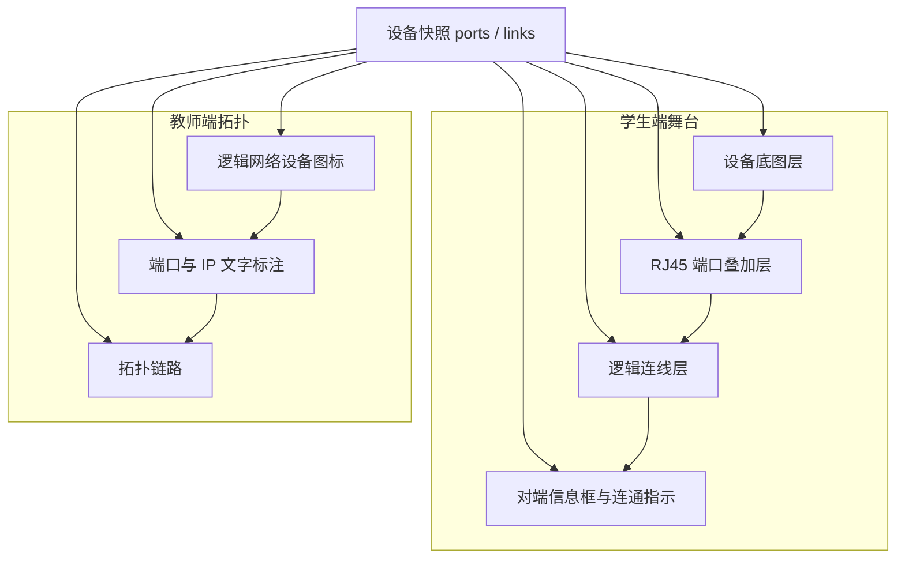

# 前端设备展示 技术设计

Feature Name: frontend-device-ui
Created: 2026-09-22
Status: 草案，待用户确认

## Description
学生端交换机与路由器用「无网口底图 + RJ45 叠加」组成角色画面；PC 直接使用已带网口的网卡图。已填写对端的端口用逻辑线指向对端信息框（对端设备编号与端口编号）；`physically_up` 为 true 时在端口侧与信息框侧同时显示绿色圆点。教师端拓扑用逻辑网络设备图标与文字标注表达全班组网关系。本设计落实冻结需求的界面条款与 tasklist 13.1–13.5，不修改 V1.2 冻结文档。

界面需求原文：`.monkeycode/specs/2026-09-22-frontend-device-ui/requirements.md`
画面与布局细则：`docs/05-前端界面设计.md`

## Architecture

学生端 `DeviceStage` 只服务学生角色画面。教师端 `TopoCanvas` 使用独立的逻辑图标组件。HTTP 写配置；学生端收到 `topology.updated` 后重绘对应端口的线、框与绿点；教师端收到同一事件后刷新逻辑图标标注与链路样式。

## Components and Interfaces

| 模块 | 职责 |
| --- | --- |
| `DeviceStage` | 底图、端口槽位、逻辑线、信息框的舞台容器 |
| `ChassisView` | 按 `DeviceKind` 加载交换机 / 路由器 / 网卡底图 |
| `Rj45Port` | 单个 RJ45 叠加、`port_id` 标签、端口侧绿点、点击后编辑对端 |
| `PeerBox` | 对端设备编号、对端 `port_id`、信息框侧绿点 |
| `LogicLinkLayer` | 从端口中心到信息框左缘的逻辑线 |
| `RoleWorkbench` | 角色操作区：MAC/ARP 表、对话、ping、模拟选口、TAP 过路帧 |
| `TopoCanvas` | 教师拓扑画布：逻辑图标布局、链路、TAP 挂接 |
| `LogicalDeviceIcon` | 按 `DeviceKind` 绘制路由器 / 交换机 / PC / TAP 示意符号 |

数据来源：join 快照与 WS 增量中的 `ports[].port_id`、`peer_port_id`、`ip`、`gateway`，以及 `links[].physically_up`。写路径沿用已有 `PUT /api/v1/devices/{device_id}/ports/{*port_id}`。

## 素材映射

| 运行时逻辑名 | 目标路径 | 源文件 |
| --- | --- | --- |
| switch chassis | `assets/icons/switch.svg` | `assets/icons/source/无网口灰色交换机正面实物图.png` |
| router chassis | `assets/icons/router.svg` | `assets/icons/source/无网口灰色路由器正面实物图.png` |
| pc chassis | `assets/icons/nic.svg` | `assets/icons/source/网卡正面实物图.png` |
| tap chassis | 复用 `switch.svg` | 同上交换机源图 |
| rj45 | `assets/icons/rj45.svg` | `assets/icons/source/RJ45端口正面实物图.png` |

矢量描摹已暂停。开发阶段 `ChassisView` 可直接引用 `source/` 原图占位；交付前替换为轻量 SVG。3 Mbps 课堂带宽下，单张底图目标小于 40 KB，RJ45 小于 8 KB。
上表仅用于学生端舞台。教师端逻辑图标由前端内联 SVG 绘制。

## 教师逻辑图标

| 角色 | 示意形态 | 标注 |
| --- | --- | --- |
| 路由器 | 圆角矩形，中心标记 R | `device_id`，各口 `port_id` 与 IP |
| 交换机 | 扁矩形，底边短竖线表示端口 | `device_id`，各口 `port_id` |
| PC | 显示器外形，中心标记主机 id | `device_id`，单口 `port_id` 与 IP |
| TAP | 链路上的双口菱形 | `device_id` 与两口 `port_id` |

图标边长约 56–72 CSS 像素，描边 `#334155`，填充浅色。链路：`physically_up` 为 true 时实线 `#16a34a`；单端填写时虚线 `#94a3b8`。节点按角色分行或自动力导向布局，保证 TAP 落在所挂链路线段中点。

## 端口槽位

交换机与路由器在底图前面板空白区布置端口：

| 区域 | 相对底图百分比 |
| --- | --- |
| 槽位左缘 | 12% |
| 槽位右缘 | 88% |
| 槽位上缘 | 48% |
| 槽位下缘 | 82% |

N 小于等于 8 时单排均分；N 大于 8 时两排，每排 `ceil(N/2)`。PC 不再叠加 RJ45：热区与绿点锚在网卡图已有插口上，默认坐标 x=18%、y=62%，接入轻量 SVG 后按实图像素校准。

## 逻辑线与绿点

信息框固定在舞台右侧，按端口序号自上而下排列。逻辑线从端口中心连到对应信息框左缘中点，描边 `#64748b`；`physically_up` 为 true 时描边改为 `#16a34a`。绿点直径约为端口短边的 18%，颜色 `#22c55e`：端口侧贴在网口右上角，信息框侧贴在卡片左缘外侧。信息框只展示对端设备编号与端口编号。

TAP 两口同样走逻辑线。对端枚举仍只给出链路两端设备端口；TAP 学生画面只读对端，由教师挂接写入。

## Data Models

前端舞台只消费课堂已有字段，不新增后端模型。

| 字段 | 用途 |
| --- | --- |
| `kind` | 学生端选底图；教师端选逻辑图标 |
| `port_count` / `ports.length` | 叠加 RJ45 个数 |
| `ports[].port_id` | 端口标签 |
| `ports[].peer_port_id` | 是否画逻辑线与信息框 |
| `ports[].ip` | 本口 IP 编辑（PC / 路由器）；对端信息框不展示 IP |
| `links[].physically_up` | 学生端绿点开关；教师端链路实线 / 虚线 |

## Error Handling

| 场景 | 处理 |
| --- | --- |
| 底图文件缺失 | 舞台显示设备 `id` 与端口列表，槽位用矩形占位 |
| 对端端口不在当前快照 | 信息框只显示已填的 `peer_port_id` |
| WS 增量只含部分端口 | 只更新对应线、框、绿点，底图保持 |
| 教师拓扑设备增删 | 重排逻辑图标位置，保留已有链路样式 |

## Test Strategy

1. 交换机 `port_count=4`：底图 1 张，RJ45 4 个，标签为 `S1/01` 至 `S1/04`。
2. 路由器 `port_count=2`：底图为路由器图，RJ45 2 个。
3. PC：底图为网卡图，热区对齐图上已有插口，画面上无额外 RJ45 叠加图。
4. TAP：底图为交换机图，RJ45 2 个。
5. 单端填写 `peer_port_id`：有逻辑线与信息框，两侧无绿点。
6. 互指成功：两侧绿点出现。
7. 清空 `peer_port_id`：该口逻辑线与信息框消失。
8. 教师拓扑含交换机、路由器、PC、TAP 各一台：四种逻辑图标均可识别，画面为逻辑图标与文字标注。
9. 教师拓扑单端填写：对应链路为虚线。
10. 教师拓扑互指成功：对应链路为绿色实线。
11. 教师放置 TAP：TAP 逻辑图标出现在目标链路线段上。

## References

- 冻结需求：`.monkeycode/specs/2026-09-19-classroom-network-sim/requirements.md`
- 界面需求：`.monkeycode/specs/2026-09-22-frontend-device-ui/requirements.md`
- 画面说明书：`docs/05-前端界面设计.md`
