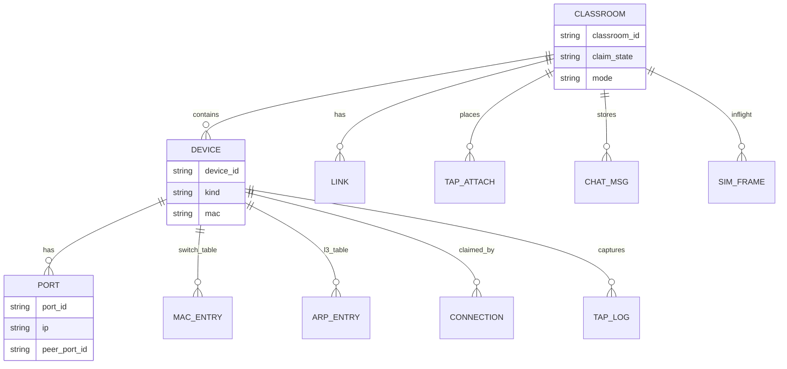

# 纸上谈网 数据详细设计文档

文档版本：V1.2  
更新日期：2026-09-20

## 修订说明

| 版本 | 日期 | 说明 |
| --- | --- | --- |
| V1.0 | 2026-09-20 | 课堂状态以内存为主、SQLite 快照为辅；表结构对齐用户提供的数据库设计文档写法 |
| V1.1 | 2026-09-20 | 校核：waiting 连接保留且 device_id 空；满员不建连接；断线不释放 claimed_connection_id |
| V1.2 | 2026-09-20 | 去掉参考文档中的考勤/学期/审批范围；课堂码本期不实施 |

## 1. 数据库设计目标

1. 支撑一堂课的设备、端口、链路、表项、聊天与模拟帧。
2. 100 连接同堂时读多写少，写操作串行落在课堂粒度锁上，避免全库事务。
3. 2 GB 内存下运行态只保留当前课堂；SQLite 只存课堂快照，便于教师机重启后恢复定员与拓扑，不存图标二进制。

## 2. 本期实施范围冻结

**做：** 单课堂运行态；设备与端口；物理链路；TAP 挂接；MAC/ARP 物化表；聊天记录（当前课）；模拟帧在途与 TAP 日志。  
**不做：** 课堂码（本期不实施）。

默认同时只开 1 个活跃课堂。若需多课堂，按 `classroom_id` 分槽，本期实现按单课堂验收。

## 3. 总体关系

## 4. 核心统一设计规范

### 4.1 主键

业务可见 ID 用短字符串：`R1`、`R1/01`、`PC1`。内部可另有整数 `row_id`。课堂内 ID 唯一。

### 4.2 时间

`created_at` / `updated_at` 用 UTC 毫秒。聊天与 TAP 日志按时间序。

### 4.3 状态

| 实体 | 状态字段 | 取值 |
| --- | --- | --- |
| classroom.claim_state | `draft` / `open` / `full` | 草稿不定员领取 / 开放领取 / 已领完 |
| classroom.mode | `normal` / `simulation` | |
| link.physically_up | bool | 两端互指 |
| sim_frame.location | `device_id` | 当前所在设备；已送达目的 PC 后归档 |

### 4.4 操作主体

写操作记录 `actor_connection_id`。不建 user 表。

### 4.5 外键

`port.device_id` → device；`link` 两端 → port；`tap_attach.link_id` → link；`connection.device_id` → device 可空（仅 waiting_open 未领）。

### 4.6 删除

课堂结束物理删除该课堂全部运行态。不做软删除。

### 4.7 安全

快照文件不含 token。MAC/IP 为课堂模拟数据。

## 5. 表设计

### 5.1 classroom

| 列 | 类型 | 说明 |
| --- | --- | --- |
| classroom_id | TEXT PK | |
| title | TEXT | |
| claim_state | TEXT | draft/open/full |
| mode | TEXT | normal/simulation |
| created_at | INTEGER | |

### 5.2 device

| 列 | 类型 | 说明 |
| --- | --- | --- |
| classroom_id | TEXT | |
| device_id | TEXT | PK 联合课堂 |
| kind | TEXT | `router` `switch` `pc` `tap` |
| mac | TEXT | PC：真实或生成；路由器每口 MAC 见 port；交换机无通信 MAC |
| claimed_connection_id | TEXT NULL | |

路由器设备级 MAC 不用；每个 router port 有 `mac`。PC 一个 MAC。TAP 无通信 MAC。

### 5.3 port

| 列 | 类型 | 说明 |
| --- | --- | --- |
| port_id | TEXT | 如 R1/01 |
| device_id | TEXT | |
| ip | TEXT NULL | 交换机口空 |
| mask | TEXT | 恒为 255.255.255.0 |
| gateway | TEXT NULL | 仅 PC |
| peer_port_id | TEXT NULL | 学生填写的对端 |
| mac | TEXT NULL | 路由器口、PC 网卡 |

### 5.4 link

| 列 | 类型 | 说明 |
| --- | --- | --- |
| link_id | TEXT | |
| port_a | TEXT | 字典序较小的 port_id |
| port_b | TEXT | |
| physically_up | INTEGER | 1 当 a.peer=b 且 b.peer=a |

### 5.5 tap_attach

| 列 | 类型 | 说明 |
| --- | --- | --- |
| tap_id | TEXT | device_id kind=tap |
| link_id | TEXT | 串在这条物理链路上 |

逻辑转发路径：`port_a` → TAP → `port_b`。其它角色仍视 `port_a` 直连 `port_b`。

### 5.6 mac_entry

交换机物化表，连通后立即写入，不靠学习。

| 列 | 说明 |
| --- | --- |
| switch_id | 交换机 |
| port_id | 本交换机端口 |
| mac | 对端设备通信 MAC |

对端是 PC：用 PC MAC。对端是路由器口：用该口 MAC。对端经 TAP：仍记链路对端设备 MAC。

### 5.7 arp_entry

| 列 | 说明 |
| --- | --- |
| device_id | PC 或路由器 |
| ip | |
| mac | |

生成规则：

1. 本口已有 IP 且该口物理连通：把同 C 类网段内其它已配 IP 的设备写入。
2. PC 已填网关且到网关链路物理连通：写入网关 IP↔网关 MAC。

C 类网段：IP 与 `255.255.255.0` 按位与后相等则同网段。

### 5.8 connection

| 列 | 说明 |
| --- | --- |
| connection_id | PK |
| client_kind | teacher / student-standalone / student-hosted |
| device_id | NULL 仅表示 waiting_open 未领 |
| last_seen | 心跳 |

满员连接不创建长期 connection，HTTP 直接返回 `full`。

状态约定：

1. `waiting_open`：有 connection，`device_id` 为空；open-claim 后就地领取或改为满员结束。
2. `claimed`：`device_id` 与 `device.claimed_connection_id` 互指。WS 断线或心跳超时不清除这两列，学生用原 `connection_id` 重连。
3. `full`：不创建 connection。仅教师结束课堂后释放角色池，该 `device_id` 才可再领。

### 5.9 chat_msg

| 列 | 说明 |
| --- | --- |
| msg_id | |
| from_ip | |
| to_ip | |
| text | 汉字原文 |
| delivered | 是否因可达而投递 |

只保留本课堂，上限 1000 条，超出丢最旧，适配内存。

### 5.10 sim_frame

| 列 | 说明 |
| --- | --- |
| frame_id | |
| dst_mac src_mac src_ip dst_ip payload | 与接口一致 |
| at_device_id | 当前所在 |
| status | inflight / delivered |

在途帧上限按同时通信对数 × 路径跳数估算，100 人课建议上限 256 个 inflight。

### 5.11 tap_log

| 列 | 说明 |
| --- | --- |
| tap_id | |
| frame_json | 过路帧副本 |
| at | |

每 TAP 上限 500 条。

## 6. 内存与 SQLite

| 数据 | 内存 | SQLite |
| --- | --- | --- |
| 课堂/设备/端口/链路/TAP | 主副本 | 每次成功写后异步刷快照 |
| MAC/ARP | 主副本，由连通规则重算 | 可重建，快照可省略 |
| connection / inflight frame | 仅内存 | 不落盘 |
| chat / tap_log | 内存环形缓冲 | 可选 |

进程内结构：`Classroom { devices, ports, links, tables, hub }`，课堂级 `RwLock`。100 连接只争这一把锁的写侧；读拓扑用快照克隆或短读锁。

教师机重启：快照恢复定员与拓扑，清空 `claimed_connection_id`；connection 本就不落盘。学生重新 join 再领取。进程仍在、仅 WS 掉线时角色继续占用。

## 7. 一致性规则

1. 改 `peer_port_id` 后重算该口所在 link 的 `physically_up`，再重算两端设备表项。
2. 改 IP/网关后重算同网段 ARP。
3. 可达性不入库，每次 chat/ping/组帧现场计算。
4. 模拟模式改 MAC 只改该 `sim_frame` 行，不改设备 ARP。
5. TAP 挂接失败条件：目标 link 未物理连通，或该 TAP 已挂其它 link。

## 8. 可达性计算（不落表）

输入：源设备、目的 IP。

1. 目的 IP 无对应设备 → 不可达。
2. 源与目的同网段：沿交换机与 TAP 的物理链路 BFS，能到目的 → 可达。
3. 不同网段：源必须是 PC 且 gateway 等于通往目的网段的路由器近端口 IP；再检查源到该路由口、路由口到目的的物理连通与地址配齐。

## 9. ID 与 MAC 生成

| 项 | 规则 |
| --- | --- |
| 独立 PC MAC | 客户端上报，校验 `xx:xx:xx:xx:xx:xx` |
| 托管 PC MAC | 服务端随机，本地管理位清零，形如真实单播 |
| 路由器口 MAC | 开课生成，每口不同 |
