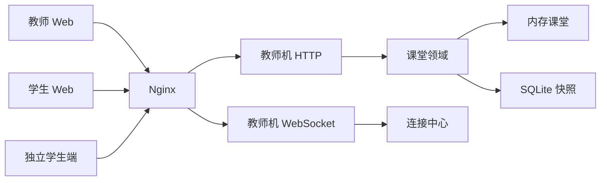

# 纸上谈网 后端开发实施规划文档

文档版本：V1.2  
更新日期：2026-09-20

## 1. 文档目的

把已锁定需求拆成可编码、可验收的后端阶段。每个阶段含目标、小任务、产出、测试、通过基线。编码以本文件与接口/数据设计为准。

## 2. 后端总体开发目标

### 2.1 后端总体能力

1. 课堂定员、领取、满员文案。
2. 端口互指、IP/网关、拓扑增量、MAC/ARP 物化。
3. 可达性、普通模式 chat/ping。
4. 模拟模式组帧、选口、改 MAC、TAP 旁路记帧。
5. 同一套 API 服务独立端与托管端；Nginx 同机反代；100 连接在 2C2G/3Mbps 下可上课。

## 3. 核心开发原则

1. 课堂状态以教师机内存为准，学生端不自作拓扑裁判。
2. 写走 HTTP，推送走 WS 增量。
3. 选错端口只拒绝转发，不丢课堂状态。
4. 不把交叉编译 linker 写进仓库 `.cargo/config.toml`。
5. 长编译用受管后台终端，限制 CPU，避免写满磁盘。

## 4. 后端技术架构基线

| 层 | 基线 |
| --- | --- |
| 语言 | Rust 2021，workspace：shared / teacher / student |
| HTTP+WS | 教师机内嵌 Web 与 `/api/v1`、`/ws` |
| 数据 | 内存 + SQLite 课堂快照 |
| 独立学生端 | 本机小服务：采 MAC、打教师机 HTTP/WS、打开学生 UI |
| 托管学生端 | 教师机或同机静态目录提供学生 UI |
| 反代 | Nginx：`/teacher/` `/student/` `/api/` `/ws` |
| 前端预览 | 开发时前端入口反代 `/api` 到教师机 |



## 5. 项目工程结构

```
crates/shared     设备、帧、错误码、可达性纯函数
crates/teacher    HTTP/WS、课堂、Nginx 同机主进程
crates/student    独立端：MAC、连接教师机
web/teacher       教师 UI
web/student       学生 UI
```

shared 不含 IO。可达性、互指判定、选口校验放 shared，便于单测。

## 6. 后端开发阶段总览

| 阶段 | 名称 | 通过才进入下一阶段 |
| --- | --- | --- |
| P0 | 工程、课堂、WS 心跳 | 创建课堂、连 WS |
| P1 | 定员领取与满员 | waiting_open / claimed / full |
| P2 | 端口、链路、表项 | 互指后表项立即出现 |
| P3 | 可达、chat、ping | 跨网段缺网关失败 |
| P4 | 模拟模式与 TAP | 选错口留下、选对口改 MAC |
| P5 | 双端部署、Nginx、100 连接冒烟 | 2C2G 规格清单 |

## 7. P0：工程与课堂骨架

### 7.1 阶段目标

教师机能起 HTTP/WS，创建课堂，存内存课堂对象。

### 7.2 小任务

1. 补齐 workspace 依赖与 teacher 监听端口（默认 8080）。
2. `POST /classrooms` 生成 `classroom_id`。本期不生成课堂码。
3. `/ws` 心跳 `hello`。
4. SQLite 空库与 `classroom` 表可写快照。

### 7.3 产出

可 `cargo test -p papernet-shared`；teacher 进程健康检查 `GET /api/v1/health`。

### 7.4 测试用例

1. 创建课堂返回 `classroom_id`。
2. WS 连接后收到 `hello`。

### 7.5 通过基线

健康检查 200；单测覆盖 ID 生成。

## 8. P1：领取

### 8.1 阶段目标

open-claim 前后加入行为符合 SRS 第 3 章。

### 8.2 小任务

1. 库存生成 device/port。
2. join：draft→waiting_open；open 且有空位→随机 claimed；无空位→full 文案。
3. 独立端上报 nic_mac；托管端生成 MAC。
4. 一条 connection 绑定一个 device。
5. open-claim 时对已 waiting 连接立即发放角色或满员结束。
6. 断线不释放已领角色；同 connection_id 重连恢复。

### 8.3 测试用例

1. 未 open 加入 status=waiting_open。
2. 2 个 PC 定员，第 3 个 join 文案精确等于「本课设备已领完，请看教师屏」。
3. 两个连接不会领到同一 device_id。
4. 先 join 得 waiting_open，再 open-claim，该连接变为 claimed。
5. 已 claimed 断线后携同一 connection_id 再 join，仍为原 device_id。

### 8.4 通过基线

上述 5 条自动化测试通过。

## 9. P2：拓扑与表项

### 9.1 小任务

1. PUT 端口 IP/peer/gateway。
2. 互指计算 physically_up。
3. 连通后写 mac_entry / arp_entry。
4. 广播 topology.updated 增量。
5. TAP attach。

### 9.2 测试用例

1. 仅一端填对端，physically_up=false。
2. 两端互指后交换机 MAC 表有对端 MAC。
3. PC 填网关且链路通，ARP 含网关。
4. 对端候选不含 TAP 端口。

### 9.3 通过基线

表项规则单测全绿；一次配置后 WS 增量小于 4KB（样例课堂）。

## 10. P3：普通模式通信

### 10.1 小任务

1. shared 可达性函数（同网段 BFS、跨网段网关）。
2. chat / ping HTTP。
3. 不可达错误码 UNREACHABLE。

### 10.2 测试用例

课堂场景 PCA—S1—R1—S2—PCB：

1. 网关正确 chat 投递。
2. PCA 网关填错 ping 失败。
3. 同网段两 PC 经交换机可达。
4. 路由器调用 chat 返回错误；仅 PC 可发文字。

### 10.3 通过基线

可达性纯函数测试覆盖同网段、跨网段、断链路。

## 11. P4：模拟模式

### 11.1 小任务

1. mode 切换广播。
2. 组帧填 MAC。
3. 交换机/路由器 forward 校验。
4. 路由器成功转发改写 MAC。
5. TAP 自动转 + tap_log。
6. 多 frame_id 并行。

### 11.2 测试用例

1. 交换机错口：帧 at_device 不变，返回 WRONG_PORT。
2. 路由器对口：下一跳收到的 dst_mac 为 PCB MAC，src_mac 为 R1/02 MAC。
3. TAP 日志条数等于经过次数。
4. 回复帧能走回源 PC。

### 11.3 通过基线

P4 用例自动化通过；本机展示在 departed 后清空。

## 12. P5：部署与容量

### 12.1 小任务

1. 独立学生端采 MAC 并 join。
2. 托管 UI 静态资源。
3. Nginx 样例配置（`/teacher/` `/student/` `/api/` `/ws`）。
4. 100 条 WS 连接心跳冒烟（可用脚本，独立数据目录）。
5. 增量事件、静态缓存验证带宽假设。

### 12.2 通过基线

1. 100 连接同时在线，教师快照可开。
2. 10 路 chat 或 4 路模拟传帧时教师屏可操作。
3. 冒烟不写用户本机目录，用临时目录。

## 13. 阶段执行基线（本阶段编码前）

当前阶段：**设计文档已出，尚未编码业务。**  
下一编码入口：P0。  
验收以 SRS + 接口第 9.4 节 + 本规划各阶段通过基线为准。
